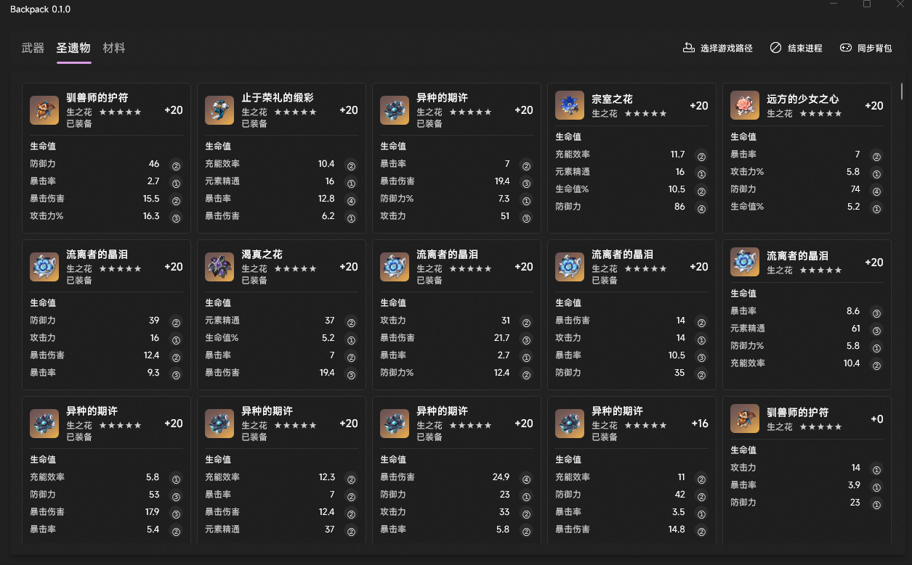

[简体中文](README.md) | [English](README.en.md)

<p align="center">
  
</p>

# Backpack

Genshin Impact inventory export tool  
No OCR. No screenshots.

<p align="center">
  
</p>

## Building

### Prerequisites

- Visual Studio 2022 Build Tools (MSVC v145)
- .NET 10 SDK
- Windows App SDK 2.2

### DLL (C++)

Open `backpack.vcxproj` in Visual Studio and build **Release | x64**, or run:

```bat
msbuild backpack.vcxproj /p:Configuration=Release /p:Platform=x64
```

Output: `x64\Release\backpack.dll`

### Viewer (C#)

```bat
cd viewer
dotnet build -c Release -p:Platform=x64
```

Output: `viewer\bin\x64\Release\net10.0-windows10.0.26100.0\win-x64\`

---

## Integration

The DLL writes JSON files to `output\` (relative to the game executable) and simultaneously pushes the same data to a named pipe for real-time consumption.

### Named Pipe

**Pipe name:** `\\.\pipe\ky3-backpack`

Each message is a single connection with a fixed 16-byte header followed by a UTF-8 JSON payload:

| Offset | Size | Type | Description |
|--------|------|------|-------------|
| 0 | 4 | `uint32_le` | JSON payload length in bytes |
| 4 | 12 | `char[12]` | Event name, null-padded — see table below |
| 16 | N | `utf-8` | JSON payload |

A new connection is made per event. Read the 16-byte header first, then read exactly N bytes.

**Event names:**

| Event | JSON file | Content |
|-------|-----------|---------|
| `weapon_bag` | `output\weapon_bag.json` | All weapons in inventory |
| `artifact_bag` | `output\artifact_bag.json` | All artifacts in inventory |
| `material_bag` | `output\material_bag.json` | All materials in inventory |
| `player_prop` | `output\player_prop.json` | Player stats (AR, WL, stamina …) |

### JSON Schema

**weapon_bag.json**

```json
{
  "weapons": [
    {
      "id": 11301,
      "guid": "2251799814125937",
      "name": "黎明神剑",
      "type": "单手剑",
      "rank": 3,
      "specialProp": "攻击力",
      "level": 40,
      "promote": 2,
      "refine": 1
    }
  ]
}
```

**artifact_bag.json**

```json
{
  "artifacts": [
    {
      "id": 37543,
      "guid": "2251799814125938",
      "setName": "烬城勇者绘卷",
      "name": "驯兽师的护符",
      "slot": "生之花",
      "equipped": true,
      "level": 20,
      "rank": 5,
      "mainStat": { "type": "生命值", "typeRaw": "FIGHT_PROP_HP" },
      "subStats": [
        { "type": "防御力",   "typeRaw": "FIGHT_PROP_DEFENSE",       "value": 46,   "rolls": 2 },
        { "type": "暴击率",   "typeRaw": "FIGHT_PROP_CRITICAL",       "value": 2.7,  "rolls": 1 },
        { "type": "暴击伤害", "typeRaw": "FIGHT_PROP_CRITICAL_HURT",  "value": 15.5, "rolls": 2 },
        { "type": "攻击力%",  "typeRaw": "FIGHT_PROP_ATTACK_PERCENT", "value": 16.3, "rolls": 3 }
      ]
    }
  ]
}
```

**material_bag.json**

```json
{
  "materials": [
    { "id": 104001, "name": "甜甜花", "category": "specialty_mondstadt", "count": 12 }
  ]
}
```

---

## Project structure

```
Backpack/
├── artifact/             Artifact Protobuf parsing and JSON output
├── db/                   Static lookup tables generated from ExcelConfigData
│   ├── artifact_db.h     Affix values + main prop IDs + Chinese display names
│   ├── artifact_set_db.h Item ID → set name / piece name / star rating
│   └── weapon_db.h       Weapon metadata
├── hook/                 DLL entry (dllmain), MinHook setup, packet dispatch
├── include/
│   ├── ipc.h             Named pipe push helper
│   ├── offsets.h         RVA constants
│   ├── output.h          JSON format strings
│   └── proto.h           Protobuf varint walker
├── material/             Material Protobuf parsing and JSON output
├── prop/                 Player property parsing and JSON output
├── third_party/MinHook/  Embedded MinHook — no external dependency
├── weapon/               Weapon Protobuf parsing and JSON output
├── viewer/               WinUI 3 desktop viewer (C# / .NET 10)
└── backpack.vcxproj      C++ project file (MSVC Release|x64)
```

## Runtime directories

The following subdirectories are created automatically next to the exe on first run:

| Directory | Contents |
|-----------|----------|
| `modules/` | `backpack.dll`, injected automatically by the Viewer on launch |
| `data/` | `backpack.db`, SQLite database storing historical inventory data |
| `output/` | `weapon_bag.json` / `artifact_bag.json` / `material_bag.json` / `player_prop.json`, overwritten on each sync |

---

## Issues

If you encounter a crash, incorrect data, or unexpected behavior, please open an [Issue](../../issues) and include:

- Game version
- OS version
- Steps to reproduce
- Relevant JSON files from `output\` (if any)

## Contributing

Pull Requests are welcome:

- Bug fixes
- Parsing support for new item types

## Disclaimer

This tool reads data by hooking game process memory. Such behavior may violate the game's terms of service. **Use at your own risk — account bans are possible.** This project is intended for educational and research purposes only. Do not use it for any commercial or prohibited purpose.

## License

[MIT](LICENSE) © 2026 KY3 Studio
