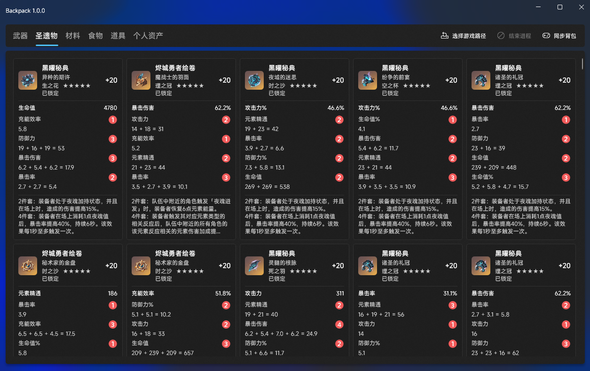
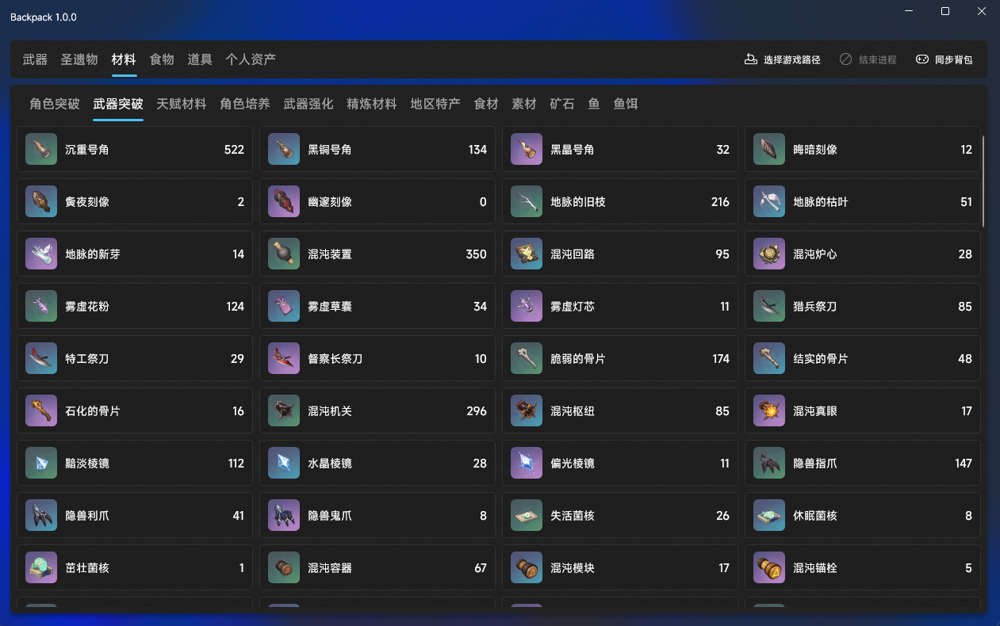

[简体中文](README.md) | [English](README.en.md)

<p align="center">
  
</p>

<h1 align="center">Backpack</h1>

<p align="center">
  A Genshin Impact inventory browser &middot; Real-time in-game sync &middot; Local storage
</p>

<p align="center">
  
  
  
  
</p>

<p align="center">
  
  
</p>

---

## Features

- **No OCR · No screenshots** — Parses raw game data

| Category | Data |
|---|---|
| Weapons | Name · Level · Refinement · Rarity · Type · Main stat |
| Artifacts | Name · Slot · Enhancement · Main stat · 4 sub-stats (rolls) · Set effect |
| Materials | 12 sub-types: Char ascension / Weapon ascension / Talent / Char EXP / Weapon EXP / Refinement / Local specialty / Food / Crafting / Ore / Fish / Bait |
| Food | Name · Quantity · Quality · Healing / Attack / Defense / Exploration / Special / Inspirational |
| Gadgets | Name · Quantity · Quality · Precious / Exploration / Nation emblems / Wishes / Gadgets / Consumables / Quest items |
| Assets | Primogem · Mora · Genesis Crystal · Realm Currency · Toy Medal · Starglitter etc. |

## Requirements

- Windows 10 2004 (19041) x64 or later
- Genshin Impact CN / ~~Global~~ (coming soon)

## Installation

Download the latest installer from [Releases](../../releases) and follow the on-screen instructions.

## Usage

1. Launch Backpack
2. **Select Game Path** and point to the Genshin executable
3. Click **Sync Backpack** and wait for the game to start
4. Once in-game, data loads automatically and your inventory appears in the window

> Data is cached locally, so subsequent launches display the last snapshot without re-syncing.

## Interface

> Third-party tools can receive data in real-time via named pipe, or parse `backpack.json` directly.

### Named Pipe

Pipe name: `\\.\pipe\ky3-backpack`

Frame format: **4 bytes** data length (uint32 LE) + **12 bytes** event name (ASCII, null-padded) + body (UTF-8 JSON)

| Event | Body type |
|---|---|
| `weapon` | Weapon array |
| `artifact` | Artifact array |
| `avatar` | Character array |
| `material` | Material array |
| `prop` | Account assets object |

### backpack.json

Written to `<game_dir>/output/backpack.json` after each sync. Top-level structure:

```json
{
  "source": "ky3-backpack", "version": 1,
  "account": { ... },
  "characters": [ ... ],
  "weapons":    [ ... ],
  "artifacts":  [ ... ],
  "materials":  [ ... ]
}
```

| Field | Type | Description |
|---|---|---|
| `source` | string | Always `"ky3-backpack"` |
| `version` | int | Schema version, currently `1` |
| `account` | object | Account assets, see below |
| `characters` | array | Character list |
| `weapons` | array | Weapon list |
| `artifacts` | array | Artifact list |
| `materials` | array | Material list |

---

#### account

```json
{ "playerLevel": 56, "primogem": 1158, "mora": 18942097,
  "worldLevel": 8, "resin": 200, "genesisCrystal": 3,
  "legendaryKey": 3, "homeCoin": 300, "toyToken": 5,
  "qiyuCoin": 140, "reshowCrystal": 720 }
```

| Field | Type | Description |
|---|---|---|
| `playerLevel` | int | Adventure rank |
| `primogem` | int | Primogems |
| `mora` | int | Mora |
| `worldLevel` | int | World level (0–9) |
| `resin` | int | Current Original Resin |
| `genesisCrystal` | int | Genesis Crystals |
| `legendaryKey` | int | Legendary Keys |
| `homeCoin` | int | Realm Currency |
| `toyToken` | int | Toy Medal |
| `qiyuCoin` | int | Qiyu Coin |
| `reshowCrystal` | int | Reshow Crystal |

---

#### Character

```json
{ "id": 10000104, "name": "娜维娅", "element": "岩", "rarity": 5,
  "level": 90, "ascension": 6, "friendship": 10, "constellation": 6,
  "skills":  [{ "id": 11042, "level": 10 }],
  "passives": [{ "id": 10439, "extra": 3 }],
  "equips": ["681646283794107680"] }
```

| Field | Type | Description |
|---|---|---|
| `id` | int | Character ID |
| `name` | string | Character name (Chinese) |
| `element` | string | Element (Chinese, e.g. `"岩"`) |
| `rarity` | int | Rarity (4 or 5) |
| `level` | int | Level (1–90) |
| `ascension` | int | Ascension phase (0–6) |
| `friendship` | int | Friendship level (1–10) |
| `constellation` | int | Unlocked constellations (0–6) |
| `skills` | array | Skill levels; each item `{ id, level }`, `id` = skill ID, `level` = skill level (1–15) |
| `passives` | array | Passive talents; each item `{ id, extra }`, `extra` = extra talent level (usually 0 or 3) |
| `equips` | array | Equipped item GUIDs; weapon first, then up to 5 artifacts |

---

#### Weapon

```json
{ "id": 11509, "guid": "681646283794166235", "name": "雾切之回光",
  "type": "单手剑", "rank": 5, "mainStat": "暴击伤害",
  "level": 90, "ascension": 6, "refine": 1 }
```

| Field | Type | Description |
|---|---|---|
| `id` | int | Weapon ID |
| `guid` | string | Instance unique ID (uint64 as string) |
| `name` | string | Weapon name (Chinese) |
| `type` | string | Weapon type (Chinese): Sword / Claymore / Polearm / Catalyst / Bow |
| `rank` | int | Rarity (1–5) |
| `mainStat` | string | Main stat name (Chinese) |
| `level` | int | Level (1–90) |
| `ascension` | int | Ascension phase (0–6) |
| `refine` | int | Refinement rank (1–5) |

---

#### Artifact

Percent stats: `value` to 1 dp, `rolls` entries to 2 dp. Flat stats are integers.

```json
{ "id": 72001, "guid": "681646283793999714",
  "set": "追忆之注连", "name": "追忆之注连·绯樱丛簪",
  "slot": "花", "rank": 5, "level": 20, "initSubStats": 4,
  "mainStat": "生命值",
  "subStats": [
    { "type": "暴击率",   "value": 3.9,  "rolls": [3.90] },
    { "type": "暴击伤害", "value": 21.8, "rolls": [7.80, 7.00, 7.00] }
  ],
  "locked": true }
```

| Field | Type | Description |
|---|---|---|
| `id` | int | Artifact ID |
| `guid` | string | Instance unique ID (uint64 as string) |
| `set` | string | Set name (Chinese) |
| `name` | string | Piece name (Chinese) |
| `slot` | string | Slot (Chinese): Flower / Plume / Sands / Goblet / Circlet |
| `rank` | int | Rarity (1–5) |
| `level` | int | Enhancement level (0–20) |
| `initSubStats` | int | Initial sub-stat count (3 or 4) |
| `mainStat` | string | Main stat name (Chinese) |
| `subStats` | array | Sub-stats (up to 4) |
| `subStats[].type` | string | Sub-stat name (Chinese) |
| `subStats[].value` | number | Total sub-stat value |
| `subStats[].rolls` | array | Value of each individual roll; length equals number of upgrades |
| `locked` | bool | Whether the artifact is locked |

---

#### Material

```json
{ "id": 104003, "name": "精锻用魔矿", "type": "矿石", "count": 42 }
```

| Field | Type | Description |
|---|---|---|
| `id` | int | Material ID |
| `name` | string | Material name (Chinese) |
| `type` | string | Sub-type (Chinese), see Features table |
| `count` | int | Quantity |

## Building

**Prerequisites**

- Visual Studio 2022 with C++ Desktop Development workload
- .NET 10 SDK

**C++ parsing layer**

```bash
msbuild backpack.vcxproj /p:Configuration=Release /p:Platform=x64
```

**C# viewer**

```bash
dotnet build viewer\viewer.csproj -c Release -p:Platform=x64
```

Publish (self-contained):

```bash
dotnet publish viewer\viewer.csproj -c Release -p:Platform=x64 -r win-x64 --self-contained
```

## License

[MIT](LICENSE) © 2026 KY3 Studio
